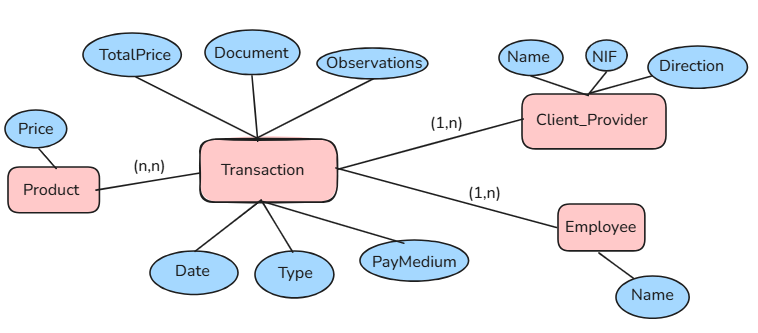
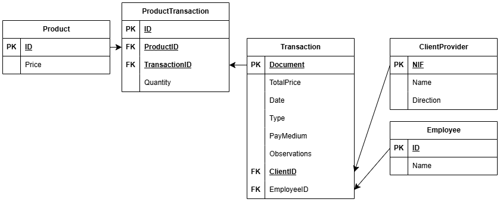

# Data exercise

## Modelo entidad relación



## Modelo relacional




## Install and run

```bash
python -m venv .venv
source .venv/bin/activate
pip install -r requirements.txt
```

Run jupyter notebook to see the data treatment

```bash
jupyter lab
```

Run database on Docker

```bash
docker run --name testdb -e MYSQL_ROOT_PASSWORD=pass123 -e MYSQL_DATABASE=testdb -p 3306:3306 -d mysql:8.0
```

Run database population script

```bash
python src/createDatabase.py
```

## Result

Screenshot of data in `transaction` table


