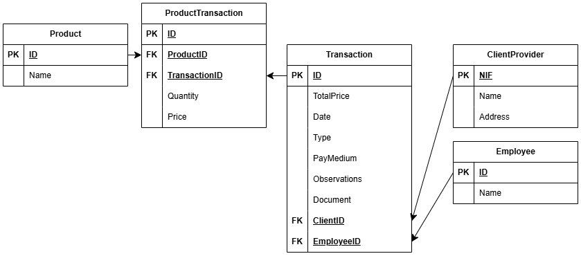

# Data exercise

## Modelo entidad relación


## Modelo relacional




## Install and run

```bash
python -m venv .venv
source .venv/bin/activate
pip install -r requirements.txt
```

Run jupyter notebook to see the data treatment

```bash
jupyter lab
```

Run database on Docker

```bash
docker run --name testdb -e MYSQL_ROOT_PASSWORD=pass123 -e MYSQL_DATABASE=testdb -p 3306:3306 -d mysql:8.0
```

Run database population script

```bash
python src/createDatabase.py
```

## Process

Once in jupyter notebook, you can look at the diferent files in `src` in this order:

- [exploration.ipynb](src/exploration.ipynb)
- [clients.ipynb](src/clients.ipynb)
- [employees.ipynb](src/employees.ipynb)
- [transaction.ipynb](src/transaction.ipynb)
- [normalize.ipynb](src/normalize.ipynb)

If you run these files CVSs with the data to populate the database will be created in the `exports` folder

Finaly you can run the [createDatabase.py](src/createDatabase.py) file to create and populate the database with the CSV values.

## Result

Screenshot of data in `transaction` table


